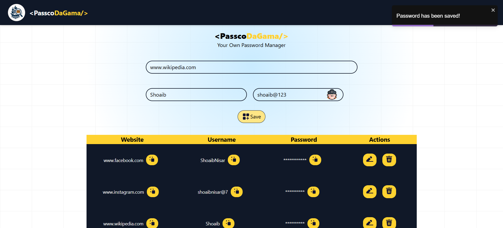

# 🔐 PasscoDaGama – Password Manager

PasscoDaGama is a modern, minimalistic password manager built with React, TailwindCSS, and Vite. It helps users securely store and manage their passwords, with the ability to copy credentials quickly and open associated websites.

## 🌟 Features

- 🔒 Add and view saved passwords
- 🌐 Open website links directly from the app
- 📋 Copy passwords or site names with one click
- 💅 Fully responsive and mobile-friendly
- ⚡ Built with Vite for fast development
- 🎨 Styled using TailwindCSS
- 🧠 Clean and organized UI components

## 📸 Screenshots



## 🚀 Getting Started

### Prerequisites

- Node.js v18+
- npm

### Installation

1. **Clone the repository:**
   ```bash
   git clone https://github.com/shoaib-nisar/PasscoDaGama.git
   cd passcodagama
